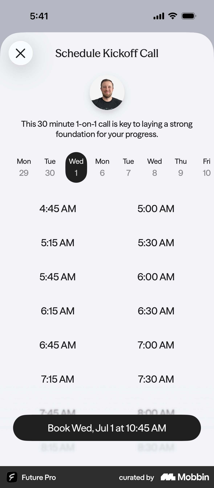
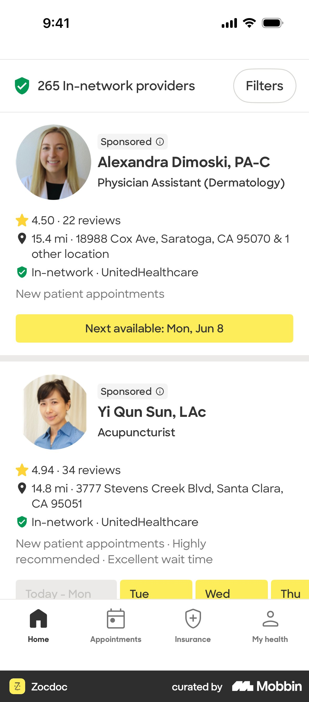
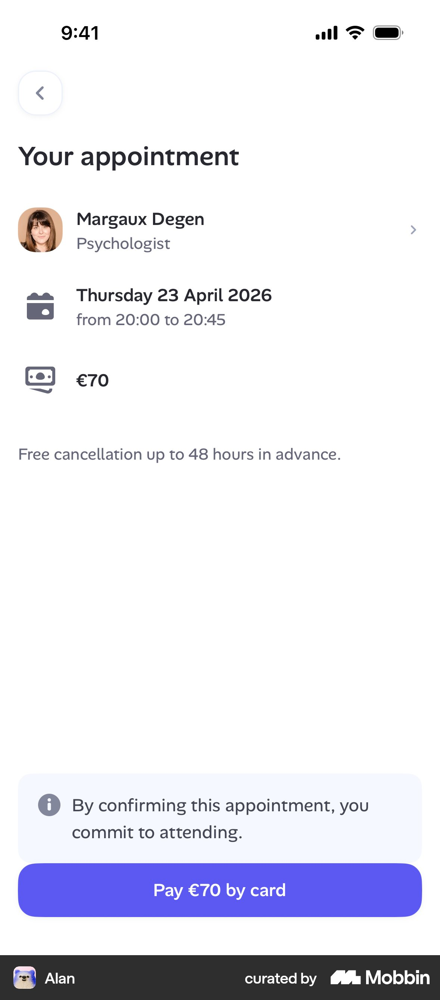
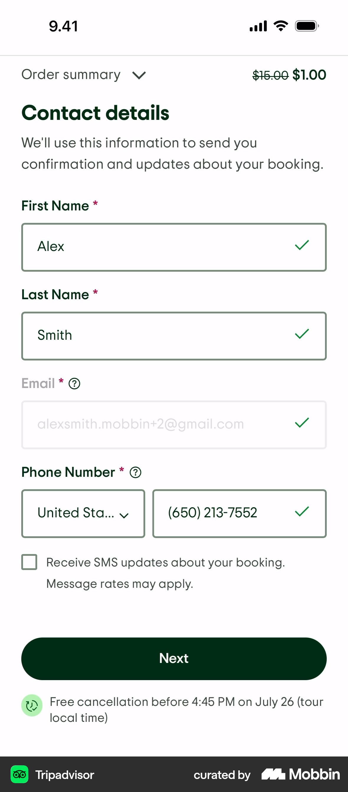
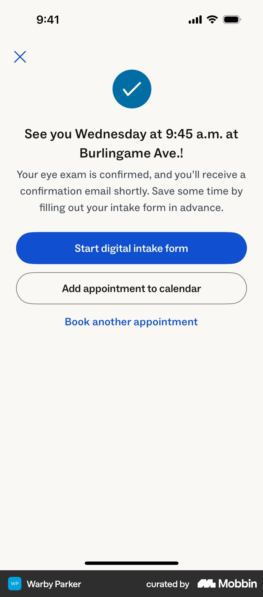

# Mobbin research: booking a time slot + confirmation

Topic: the step after the result screen. Pick a time for the free online meeting, enter contact details, see the confirmation. Source: Mobbin only (iOS + web). Images are in `img/mobbin-booking/`.

---

## 1. Purpose line + host photo above a date strip, CTA that repeats the chosen slot (Future Pro)

- **What:** A "Schedule Kickoff Call" sheet. It shows the coach's face and one line on why the call matters ("This 30 minute 1-on-1 call is key to laying a strong foundation..."). Below that is a horizontal day strip, then a 2-column time grid. The sticky button reads **"Book Wed, Jul 1 at 10:45 AM"**.
- **Why it works:** The face and the reason sit at the moment of commitment, so the user knows who they are booking with and why. The CTA echoes the slot, so it doubles as the confirmation and no separate review step is needed. The whole thing fits on one screen.
- **CompanyX:** Put the booking right after the result as a single screen. Header: clinician/nurse avatar plus "Ett kostnadsfritt 20-min videosamtal där vi går igenom dina svar". Use a day strip with a 2-col slot grid and a sticky button "Boka tor 9 okt kl 10:30".
- https://mobbin.com/screens/f02c3a7f-940b-4e92-a726-ee98eaa79d7e

## 2. "Next available" chip on the clinician card (Zocdoc)

- **What:** Each provider card has photo, title, rating and an "In-network" badge. Under it is a full-width yellow **"Next available: Mon, Jun 8"** button. The Zocdoc booking flow also shows "Tomorrow" with slot chips directly on the profile, plus "View more availability".
- **Why it works:** For most users the soonest slot is the answer. One tap books it and they never have to browse a calendar. The trust badges sit right next to the action.
- **CompanyX:** Make the first block the soonest slot: "Första lediga tid: idag 16:30" as one big tap target. "Välj annan tid" opens the strip/grid. Show today/tomorrow slots without any calendar interaction.
- https://mobbin.com/screens/45223838-dec4-4f39-99e9-d77f8a403c40 · flow: https://mobbin.com/flows/fcd6461e-af19-4ca9-9864-8b21c286888c

## 3. Clinician profile: who you'll meet, format, languages, safety note (Alan)

- **What:** Photo, name, "Psychologist", "Available on Thursday · 45 min video session", languages, a short bio, and a "Help is available" box for people in distress. The CTA "See availabilities" has "From €70 · Free cancellation up to 48 hours" underneath.
- **Why it works:** It answers "who, how long, what format, what language" before the user picks a time. The fine print under the CTA (price, cancellation) handles objections at the point of action. The safety box shows the service screens responsibly.
- **CompanyX:** Use a compact "Du träffar" card with photo, name, "Legitimerad sjuksköterska/läkare", "20 min · video · kostnadsfritt" and "Svenska, English". Microcopy under the CTA: "Helt gratis · Ingen förpliktelse · Avboka när som helst". For screening, if the quiz flagged a contraindication (e.g. eating disorder, pregnancy), show a gentle "Det här passar inte just nu" + help resource instead of the slot picker.
- https://mobbin.com/screens/ed903d4c-3065-4f73-a2f4-f7c6852d3736 · flow: https://mobbin.com/flows/e299d5a4-6694-42f5-bdfe-6869bf7cf309

## 4. Review card: person, time, cost in three rows, then commit (Alan)

- **What:** "Your appointment" has three icon rows: clinician (avatar + role), date with from–to time, and price. Then "Free cancellation up to 48 hours in advance" and an info note "By confirming this appointment, you commit to attending" above the CTA.
- **Why it works:** The summary is short enough to scan in a second. The commitment line is soft and reduces no-shows without sounding scary.
- **CompanyX:** Use the same three rows: Vem / När / Kostnad: **0 kr**. Make "0 kr" prominent, because it is the strongest conversion lever for a free meeting. If the flow stays at one screen (pattern 1), this summary can sit above the contact fields.
- https://mobbin.com/screens/9d51db29-b746-455b-837b-e85767403b33

## 5. Contact details with "why we ask" and SMS opt-in (Tripadvisor; also IKEA, Booking.com)

- **What:** "We'll use this information to send you confirmation and updates about your booking." Fields validate inline with green checks. Phone has a country selector. There is an explicit "Receive SMS updates" checkbox, and the cancellation reassurance sits under the Next button. IKEA uses the same pattern with "Almost there" and "You will receive booking reminders... at the phone number you provide."
- **Why it works:** A stated purpose for each field reduces hesitation about PII, which matters even more for health data. Inline validation prevents errors at submit. An explicit opt-in follows GDPR.
- **CompanyX:** Ask only for förnamn, e-post and mobil (prefilled +46), with one line "Vi använder detta bara för att skicka bekräftelse och påminnelse". Put the SMS reminder consent as a separate checkbox, and link the integritetspolicy. Ask for contact details *after* the slot is chosen, since the slot is the sunk-cost hook. Skip address and personnummer here and do BankID later in the meeting/onboarding.
- https://mobbin.com/screens/e0216d9d-7f2a-423d-b89e-ea7d7333385e · IKEA flow: https://mobbin.com/flows/64df5892-fc18-4edb-ba02-8b365b63bebe

## 6. Confirmation headline in human words + "do this now" next step (Warby Parker)

- **What:** Check icon and the headline **"See you Wednesday at 9:45 a.m. at Burlingame Ave.!"** Copy says a confirmation email is coming and offers to "save some time by filling out your intake form in advance". The primary CTA is "Start digital intake form", the secondary is "Add appointment to calendar", then a "Book another" link.
- **Why it works:** The headline restates the commitment in plain language. The primary action keeps momentum: prep work raises show-up rate and makes the meeting better.
- **CompanyX:** Headline "Vi ses torsdag kl 10:30!" Primary CTA "Lägg till i kalendern" (.ics + Google), because a free call has a no-show risk. Secondary: "Förbered dig (2 min)", e.g. weight/height check, current medication list. Show "Bekräftelse skickad till anna@…" so the user can see the email address was right.
- https://mobbin.com/screens/49e69531-025b-4dee-b457-397896728321

## 7. "What happens next" numbered steps + full booking details (CVS, Calendly, IKEA, Walmart)
- **What:** CVS's visit confirmation has a numbered "On the day of your visit" list (1-4). Calendly's "You are scheduled" card shows host name, time range, timezone and "Web conferencing details to follow" with an "Open Invitation" button. Walmart's confirmation lists date + "Add to my calendar", contact info, and "✓ Enrolled in text updates and reminders". IKEA adds a booking ID and the format ("Online").
- **Why it works:** Saying what happens next removes the "now what?" anxiety. Echoing the contact details and the reminder status reassures the user that nothing will be missed.
- **CompanyX:** Use a 3-step list: 1) Du får en länk via SMS + e-post, 2) Vi ringer upp via video på utsatt tid, ingen app behövs, 3) Tillsammans avgör vi om behandling passar dig, utan förpliktelse. Add a details card (Vem/När/Var: "Videolänk skickas") plus "Ändra eller avboka" links.
- CVS flow: https://mobbin.com/flows/dc9a257e-0d14-413b-905b-91a56ec4917c · Calendly: https://mobbin.com/flows/e0e18051-aa17-465a-8fe5-851659cc774b · Walmart: https://mobbin.com/screens/82114b21-f459-4ed1-9f58-d8146db333d0

## 8. Graceful "no slots" state (CVS, Alan)
- **What:** CVS: "All times at this location are booked today" followed by **"View next available"** and "Join today's waitlist". Alan's therapist list shows "Available on Thursday" vs "No availability" per person.
- **Why it works:** A dead-end day is where users drop off. Pointing them straight to the next option keeps them in the flow.
- **CompanyX:** Never show an empty day. Grey out full days in the strip, and auto-jump to the first day with slots. If there are none at all, offer "Vi ringer upp dig" as a callback request.
- https://mobbin.com/screens/16d37480-c9f5-4aba-89e8-0acf9fbd7dca

---

## Patterns to avoid (seen)
- A full-month calendar first (IKEA, Calendly). It is fine on desktop but too heavy on mobile, and on IKEA most dates are equally clickable, so there is no signal about where the free slots are.
- Long forms at booking (Zocdoc address/insurance, IKEA full address). That is too much friction for a free intro call.
- An upsell grid on the confirmation (Zocdoc "Check another exam off your list"). It pulls focus away from add-to-calendar.

## Top 3 takeaways
1. **Make the soonest slot the default.** Show "Första lediga tid" as one tap, with a day strip and slot grid as fallback. Keep it to one screen with a sticky CTA that repeats the slot ("Boka tor kl 10:30").
2. **Show a face and the terms at the moment of commitment.** Include clinician photo + credentials + "20 min · video · 0 kr · avboka fritt", and ask for contact details only after the slot is chosen, with a one-line "why we ask".
3. **The confirmation's job is to get the user to show up.** Use a human headline ("Vi ses torsdag kl 10:30!"), add-to-calendar as the primary button, the email/SMS echo, and a 3-step "så går det till" list, with no upsells.
