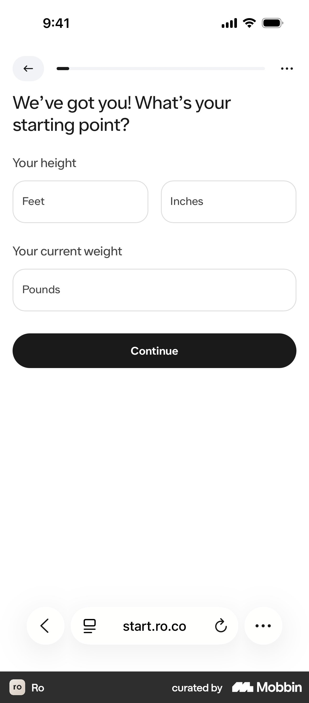
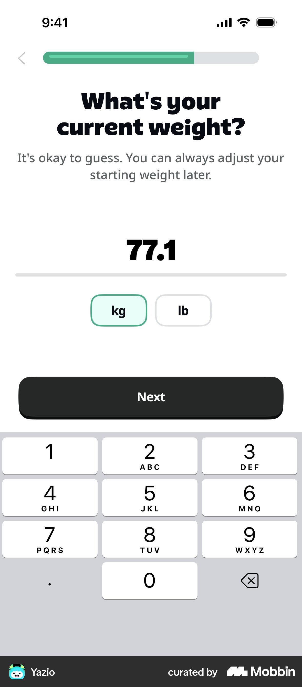
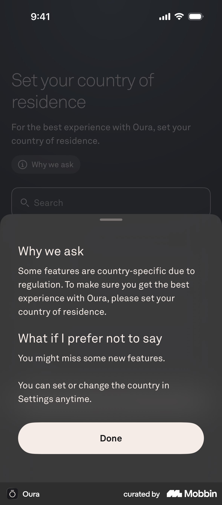
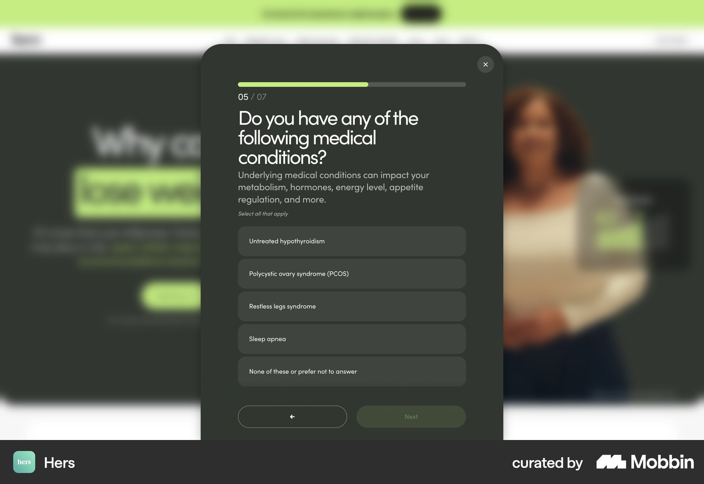
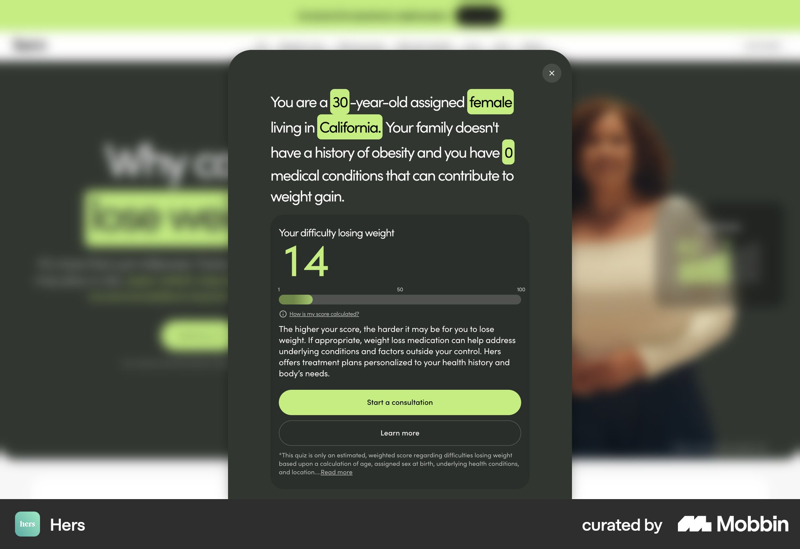

# Mobbin: health intake & weight-loss quiz question screens

Source: Mobbin MCP only (ios + web), 8 searches. Apps reviewed: Ro, Hers/Hims, Noom, Oura, Yazio, Cal AI, WHOOP, Clue, Stardust, Liven, Zocdoc.
Each pattern below is based on what the screenshot shows, not the metadata alone. Images are in `img/mobbin-intake/`.

---

## 1. Height and weight on one screen, framed as a "starting point" (Ro)

- **What:** One screen with the heading "We've got you! What's your starting point?" It has three numeric fields: height (two fields, ft + in) and current weight. A thin progress bar sits at the top. There is no help text and no illustration.
- **Why it works:** The two BMI inputs belong together, so asking for them on one screen saves a step. Calling it a "starting point" makes weight sound like the start of a journey rather than a judgement. The warm "We've got you!" opener takes the edge off a sensitive question.
- **CompanyX:** Put height and weight on one screen as `cm` + `kg` numeric inputs (`inputmode="numeric"`). Add sex and age only if they fit without scrolling. Use a heading like "Var börjar du?" ("Where are you starting from?"). Keep the reassurance line from notes.md ("Only your clinician sees this") under the weight field.
- https://mobbin.com/flows/c40ee07f-972a-43b2-83b4-666d7f6df86e (screen 5 of 20)

## 2. "It's okay to guess" microcopy on weight (Yazio)

- **What:** "What's your current weight?" with the subline "It's okay to guess. You can always adjust your starting weight later." The large number is centred, with a kg/lb chip toggle and the numeric keypad already open.
- **Why it works:** It removes the pressure of being exact, and the fear of stepping on a scale before answering, which is a real drop-off point. The keypad opening automatically saves a tap.
- **CompanyX:** Use this exact sentiment: "En uppskattning räcker, vi går igenom det tillsammans på mötet." ("An estimate is fine, we'll go through it together at the meeting.") Medically, a rough figure is fine for pre-screening because the clinician confirms it at the meeting. Autofocus the field. Use kg only (Sweden), with no unit toggle.
- https://mobbin.com/screens/2b2b032e-f176-4680-972d-3de0c98154df
- Related: Me+ uses a ruler picker with "Your personal information won't be collected or shared" (https://mobbin.com/screens/186618f9-d714-42b0-baf1-01cfcfd932a7). WHOOP and Cal AI use paired height/weight wheel pickers (https://mobbin.com/screens/cbf00a91-d454-4224-b596-dc06d0134741). Wheel pickers are slower for large values, so a typed input is better for weights over 100 kg.

## 3. "Why we ask" link that opens a bottom sheet (Oura)

- **What:** A small `(i) Why we ask` chip sits under the question. Tapping it opens a bottom sheet with two short sections: "Why we ask" and "What if I prefer not to say", then a "Done" button.
- **Why it works:** The explanation is there on demand without cluttering the screen. The "What if I prefer not to say" section is unusually honest, which builds trust. A bottom sheet keeps the user in place, so they don't lose their spot in the flow.
- **CompanyX:** This is the help-button pattern from notes.md. Add a "Varför frågar vi?" ("Why do we ask?") chip on the weight, conditions and medication screens. The sheet copy should cover (a) what the clinician uses the answer for, e.g. "GLP-1 is prescribed based on BMI and health", (b) who sees it, and (c) what happens if they're unsure. Store the copy in the question JSON config as a `help` field.
- https://mobbin.com/screens/96fb49c7-fef9-4f2c-a527-0d9a8ab0b9ae

## 4. Conditions list with a "why it matters" subline and a safe exit option (Hers)

- **What:** "Do you have any of the following medical conditions?" with the subline "Underlying medical conditions can impact your metabolism, hormones, energy level, appetite regulation…". It's marked "Select all that apply" and shows 4 options plus **"None of these or prefer not to answer"** as the last option. A "05 / 07" counter and a bar sit at the top, with Back and Next side by side.
- **Why it works:** The subline frames conditions as *reasons weight is hard*, not as faults, which takes away blame. Merging "none" and "prefer not to answer" into one option means no one is forced to disclose. With 7 steps in total, the length feels manageable.
- **CompanyX:** Use a blame-free subline such as "Vissa tillstånd gör det svårare att gå ner i vikt, och påverkar vilken behandling som passar." ("Some conditions make it harder to lose weight, and affect which treatment fits.") Make "Inget av dessa" ("None of these") the exclusive last option, so it unchecks the others. For screening, keep the GLP-1 contraindications (e.g. MTC/MEN2 history, pregnancy, pancreatitis) as a **separate** screen so the answers can be checked properly. Don't offer "prefer not to answer" on that screen.
- https://mobbin.com/screens/0d206b69-8de0-4293-8b2e-0b539e80c652 (flow: https://mobbin.com/flows/24b53bf7-435f-46df-b5fb-aebad6dd4482)

## 5. Clinical multi-select in plain language with explanations in brackets (Ro, Noom)
- **What:** Ro asks one long, precise question: "Do you currently have, or have you ever been diagnosed with, any of the following heart or heart-related conditions?" It's marked "Select all that apply" and terms are explained in brackets, e.g. "Tachycardia (episodes of rapid heart rate)". The Next button stays disabled until the user picks something. Noom uses a lighter version with checkbox cards and an explicit "None" option.
- **Why it works:** Defining terms in brackets prevents mistakes, which means more accurate screening and fewer bad matches at the meeting. Grouping conditions by body system keeps each list short.
- **CompanyX:** Write every condition in plain Swedish with the Latin term in brackets ("Högt blodtryck (hypertoni)"). Group them so no list goes past about 6 items. If a list has to be longer, use a search field, as Perplexity does (https://mobbin.com/screens/1f5291a1-e18f-47b8-98a4-d324125ff310).
- Ro: https://mobbin.com/flows/c40ee07f-972a-43b2-83b4-666d7f6df86e · Noom: https://mobbin.com/flows/e507f2f3-674c-4170-8726-ffa156477c14

## 6. Empathetic inline feedback after a sensitive answer (Liven, Noom)
- **What:** In Liven, after the user picks "Almost always" for "It's difficult for me to express emotions", a yellow card expands under the answer: "You're not alone. Many people…". Noom adds full-screen breaks with social proof ("You're in trusted hands… helped 3,627,436 people") and educational charts (the yo-yo dieting curve).
- **Why it works:** The user feels understood rather than interrogated, which is the brief's own wording. Short positive moments between questions break up the monotony that drives abandonment.
- **CompanyX:** Show a short inline reply (one line, no full-screen break) after 2–3 key answers. One example, after "Tried before without lasting results": "Det är vanligt, och inte ett misslyckande. Kroppen försvarar sin vikt." ("That's common, and it isn't a failure. The body defends its weight.") Allow at most **one** break screen, around the middle of the quiz, with a verifiable figure about CompanyX patients. Noom has several of these screens, which is too many for a 12-step flow.
- Liven: https://mobbin.com/flows/5695ec7e-a531-4d04-8381-746e3591db36 · Noom: https://mobbin.com/flows/7154e10b-ba9f-48a2-b2a4-19e7b438978e

## 7. Result screen that plays the user's answers back to them (Hers)

- **What:** "You are a [30]-year-old assigned [female] living in [California]. Your family doesn't have a history of obesity and you have [0] medical conditions…" Each answer is highlighted inline. Below it is a score card with a "How is my score calculated?" link, the primary CTA "Start a consultation" and a secondary "Learn more". A disclaimer sits at the bottom.
- **Why it works:** Seeing their own answers shows the person they were listened to and makes the result feel personal and earned. The visible "how calculated" link builds trust, especially in a medical setting.
- **CompanyX:** Open the result screen with one sentence that plays the answers back, e.g. "Utifrån ditt BMI på 32 och att du har provat flera gånger tidigare…" ("Based on your BMI of 32, and that you've tried several times before…"), followed by "medicinsk viktnedgång kan passa dig" ("medical weight loss may suit you"). Then the "Boka kostnadsfritt möte" ("Book a free meeting") CTA. Make each highlighted answer tappable to edit it, which also helps screening accuracy.
- https://mobbin.com/flows/24b53bf7-435f-46df-b5fb-aebad6dd4482 (last screen)

## 8. A "You've qualified" badge plus a single "What's next" step (Ro)

- **What:** The badge reads "You've qualified", followed by an outcome pill ("Lose 37 lbs in a year", with a footnote to its source). A "What's next?" card explains: "A Ro-affiliated provider will review your health information to make sure GLP-1s are right for you." There is one primary button, "Continue".
- **Why it works:** It celebrates the result while being honest that a clinician makes the final decision, which keeps it medically correct. There is only one thing to do next.
- **CompanyX:** Use the badge wording "Du kan passa för behandling" ("You may be suitable for treatment"). Avoid "qualified" before a clinician has reviewed the case. Add one "Nästa steg" ("Next step") card: "Ett kostnadsfritt videomöte, 15 min, med legitimerad vårdpersonal" ("A free 15-min video meeting with licensed clinical staff"). Only show an outcome claim if it has a footnote to its source.
- https://mobbin.com/flows/c40ee07f-972a-43b2-83b4-666d7f6df86e (screen 20 of 20)

---

### Progress indicators seen
- Ro uses a thin, unlabeled bar, which is honest and calm. Hers web shows "05 / 07" plus a bar, which works because the total is small. Noom uses a segmented bar per section, labelled e.g. "DEMOGRAPHIC PROFILE" and "BEHAVIORAL PROFILE QUIZ (2/10)".
- This supports notes.md: when the total is around 12, use a bar without a count. If counting at all, count *sections* ("Om dig · Hälsa · Mål", i.e. "About you · Health · Goals") rather than questions.

### Consent and privacy framing
- Hers puts a privacy acknowledgement on the intro screen ("Responses prior to account creation will not be used as part of your medical assessment"). WHOOP puts consent to health-data processing above Next. Stardust puts "Your data is private" under the heading of its conditions question.
- For CompanyX (GDPR, health data = special category): add one line of consent on the first health-data screen, not a wall of legal text at the start.

## Top 3 takeaways
1. **Explain every sensitive question with one blame-free line, plus an optional "Varför frågar vi?" bottom sheet** (Hers, Oura). This builds trust without adding steps. Add it as a `help` field in the question JSON.
2. **Merge inputs that belong together and lower the effort of answering.** Put height and weight on one screen (Ro), say "an estimate is fine" (Yazio), use "None of these" as an exclusive option, and open the numeric keypad automatically. This is the cheapest way to cut steps from 26 to about 12.
3. **Play the answers back on the result screen and be honest about who decides** (Hers, Ro). Show a personalised summary sentence, say "may suit you" with clinical review, then a single CTA to the free meeting. Both conversion and correct screening depend on this moment.
