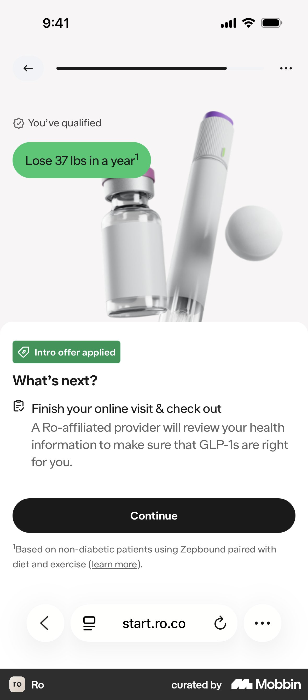
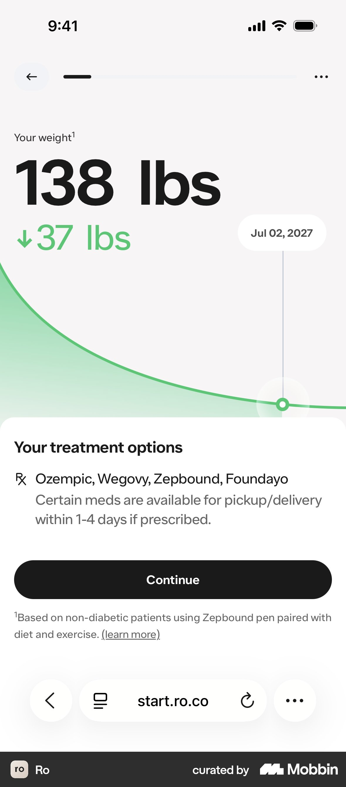
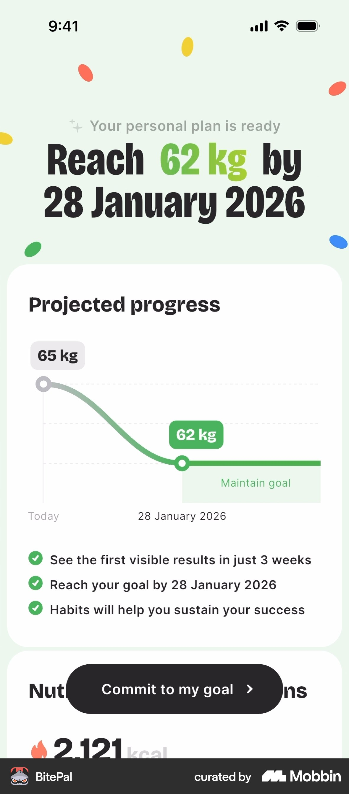
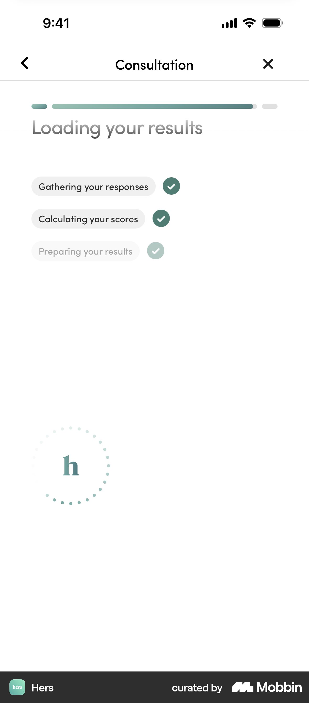
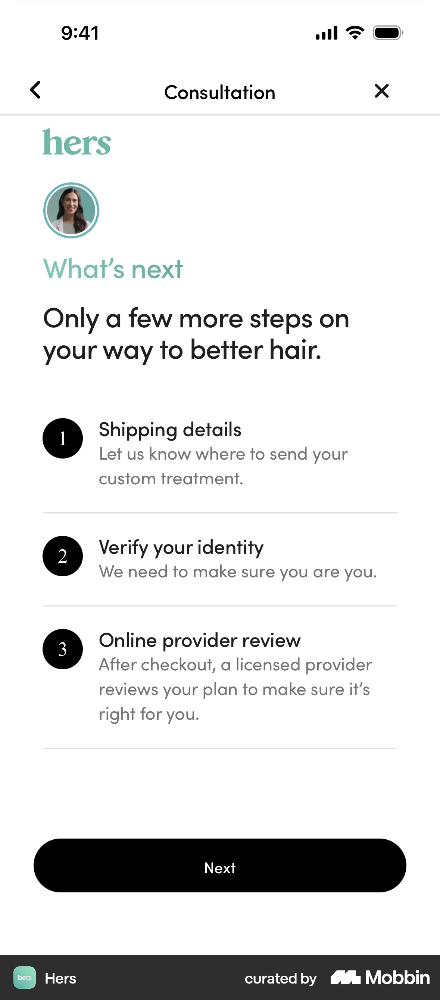

# Mobbin: quiz result / "you qualify" / plan reveal

Source: Mobbin MCP only (iOS mostly; web search returned nothing relevant for Ro/Hims). 10 searches, judged from screenshots.
Images: `.research/img/mobbin-results/`

## 1. "You've qualified" + "What's next" (Ro, GLP-1)

- **What:** Small check-chip "You've qualified" on top, a green outcome pill ("Lose 37 lbs in a year" with footnote), product photo, then a bottom sheet: "What's next?" with one step ("A Ro-affiliated provider will review your health information to make sure GLP-1s are right for you") and one black Continue button. Footnote links the source of the claim.
- **Why it works:** Gives the verdict first and quietly, and the CTA describes the next step, not a sale. Saying "the provider decides" is honest screening and builds trust. The footnote makes the number believable.
- **Velora:** Result header "Medicinsk viktnedgång kan passa dig" as a calm chip plus headline. Below it a "Vad händer nu?" sheet: "A licensed clinician goes through your answers with you in a free 20-minute video meeting. They decide together with you whether treatment fits." CTA "Välj en tid". No product photo, since Swedish rules on advertising prescription drugs mean we shouldn't name drugs.
- https://mobbin.com/screens/535e22ad-fa63-4ff3-a687-ab067a9d6810 (flow: https://mobbin.com/flows/c40ee07f-972a-43b2-83b4-666d7f6df86e)

## 2. Projected-weight curve using the user's own number (Ro)

- **What:** Huge type "138 lbs" (their projected weight) with "↓37 lbs" in green, a soft green area curve down to a dated marker ("Jul 02, 2027"), then "Your treatment options" in a sheet. The footnote says the estimate is based on non-diabetic patients and links "learn more".
- **Why it works:** The user's own numbers make the plan feel built for them. The date makes the goal concrete. The footnote keeps the claim legally and emotionally honest.
- **Velora:** Use height and weight from the quiz to show a range, not a single promise: "Many people lose 10–15% of their body weight in a year" (figure to verify against clinical sources). Show it as a band on the curve, with a footnote citing the study population. Keep the curve smooth, with no zig-zags and no before/after photos.
- https://mobbin.com/screens/9375fa7e-7052-472f-a9a7-08ed899a4ef2

## 3. Plan-ready card: headline goal + graph + 3 check bullets + sticky CTA (BitePal, Yazio, Noom, Lifesum)

- **What:** Eyebrow "Your personal plan is ready", headline "Reach 62 kg by 28 Jan", a "Projected progress" card (Today → goal, then a flat "Maintain goal" segment), three ✓ bullets ("first visible results in 3 weeks"), and a floating pill CTA "Commit to my goal". Yazio adds a dashed "without us" line for comparison. Noom adds "Highlights of your customized plan" bullets under the curve. Lifesum adds "Alex, you will reach your goal by…".
- **Why it works:** Shows the payoff before asking for anything, and the "maintain" plateau tells people the weight stays off (relevant to GLP-1 worries). The sticky CTA is always within reach.
- **Velora:** Result screen layout: eyebrow → personal headline (first name) → curve card with a "maintain" plateau → 3 bullets tied to their answers ("You said energy matters most → …") → sticky "Boka gratis möte". Skip Noom's 15-min "plan reserved" countdown timer. Fake urgency hurts trust in healthcare.
- BitePal https://mobbin.com/screens/00a7023b-04df-42ed-bfc3-b76ace782346 · Yazio https://mobbin.com/screens/9bb99bb2-df6d-43c1-85c8-36f90c93c51c · Noom https://mobbin.com/screens/e863b1da-a3eb-4319-aae0-efa5e3c0eff6 · Lifesum https://mobbin.com/screens/387e3e82-0f43-495e-b0c7-2596f690de3f

## 4. "Loading your results" checklist interstitial (Hers, Calm Sleep, BitePal, Noom)

- **What:** Hers is quiet and clinical: "Loading your results" with three chips that tick in turn ("Gathering your responses", "Calculating your scores", "Preparing your results"), plus a dotted brand spinner. Calm Sleep lists five ✓ rows ("Analyzing your sleep patterns…"). BitePal shows a % ring plus checklist plus a rotating review card. Noom uses colour bars per category ("Cross-checking with User Database").
- **Why it works:** A short "labour illusion" makes the result feel considered, not canned. It doubles as a soft transition from questions to answer. BitePal shows that this dead time can carry social proof.
- **Velora:** A 2–3 s interstitial with three ticks in Swedish, worded around care: "Går igenom dina svar", "Kontrollerar hälsofaktorer", "Förbereder ditt resultat". Optionally add one quote or a "Granskas av legitimerad personal" line under it. Keep it under 3 s, with no fake "database" claims (Noom's style reads gimmicky for medical).
- Hers https://mobbin.com/screens/44f7a26e-46b8-4512-a432-598171fb7885 · Calm Sleep https://mobbin.com/screens/6dfb3d50-0697-4362-9678-483b74456d34 · BitePal https://mobbin.com/screens/586cacfe-40e9-422f-94f4-e4b0ae1fac7f

## 5. Personal pause before the reveal (Noom)
- **What:** A full-screen serif line, "Based on your answers, Sam…", on cream, then the plan.
- **Why it works:** Uses the first name and sets up the moment. Cheap to build, high emotional pay-off. Makes the user feel understood, not processed.
- **Velora:** Fade "Tack, Anna. Utifrån dina svar…" into the result screen (the last step of the interstitial).
- Flow: https://mobbin.com/flows/7154e10b-ba9f-48a2-b2a4-19e7b438978e

## 6. Numbered "What's next" steps with a human face (Hers)

- **What:** Small clinician avatar, eyebrow "What's next", headline "Only a few more steps…", then 3 numbered rows (title plus one-line explanation). The last row is "Online provider review: a licensed provider reviews your plan to make sure it's right for you". One Next button.
- **Why it works:** Removes "what am I signing up for?" anxiety. The avatar plus "licensed provider" gives the step a person behind it. The short list makes the effort feel small.
- **Velora:** Put this on the result screen under the curve, and repeat it on the confirmation screen: ① Välj en tid (1 min) ② Videomöte med sjuksköterska/läkare, 20 min, gratis ③ Ni bestämmer tillsammans om behandling passar. Coinbase-style "Approx. 2 min" labels per step would help too.
- https://mobbin.com/screens/d906ade6-540e-4f08-ab77-e4ce3f8f27a8

## 7. Clinician card + reassurance microcopy at the booking CTA (Alan, Hers reviews)

- **What:** Alan shows a photo, name, role, "Available on Thursday · 45 min video session" and languages. A "Help is available" box covers distress. CTA "See availabilities", with "Free cancellation up to 48 hours in advance" underneath. Hers runs a full-screen verified-review card ("Verified review" badge, serif quote) between quiz and result. Ro uses real-member stories ("Lost 40 lbs in 11 months") next to "Start online visit".
- **Why it works:** A real person and a concrete next slot ("Thursday") cut the gap to booking. Microcopy under the CTA ("free cancellation") removes the last objection. Verified reviews beat anonymous stars.
- **Velora:** On result→booking, show the 2–3 clinicians on duty (photo, "Leg. sjuksköterska"), "Nästa lediga tid: idag 16:30", and under the CTA "Kostnadsfritt · Ingen förpliktelse · Avboka när du vill". Put one verified Trustpilot-style quote under the curve. No before/after photos.
- Alan https://mobbin.com/screens/ed903d4c-3065-4f73-a2f4-f7c6852d3736 · Hers review https://mobbin.com/screens/28da3912-080f-4135-96ff-a17d6a0aedbf · Ro stories (flow) https://mobbin.com/flows/93aa02c8-6eca-4611-88ef-0336853136ba

## Anti-patterns seen (avoid)
- Noom "Personalized plan reserved, expires in 14:59" countdown: fake urgency, wrong for healthcare.
- Mascot or confetti celebration (BitePal, Yazio): too playful for a weight and health conversation.
- "Cross-checking with user database" (Noom): reads as theatre and invites distrust.

## Top 3 takeaways
1. **Verdict, then personal proof, then next step, on one screen.** A calm "may suit you" chip, a curve built from *their* numbers (a range, footnoted), and a "What happens next" list ending in one sticky CTA "Boka gratis möte". Ro and Hers both put the clinician's decision in the copy, which is honest screening and builds trust.
2. **A short, care-worded loading interstitial plus a first-name reveal** ("Tack, Anna. Utifrån dina svar…"). Under 3 s, three ticks. It turns screening into "being understood" and is cheap to build.
3. **Make the meeting human and risk-free at the CTA.** Clinician faces and credentials, the next free slot, and microcopy "Kostnadsfritt · 20 min · Avboka när du vill". Skip countdowns, mascots and before/after photos.
