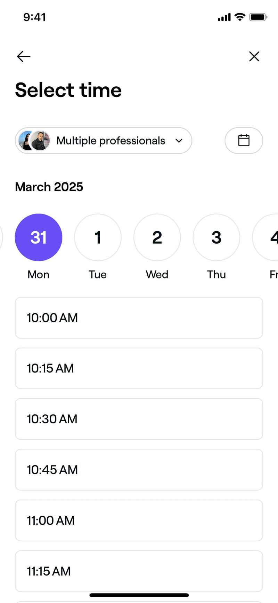
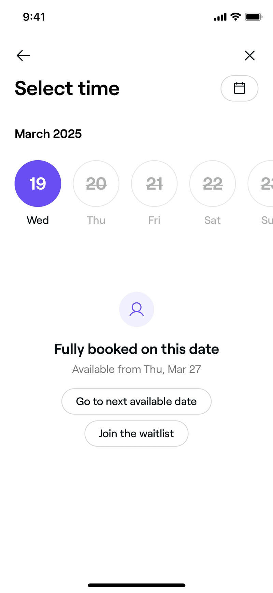
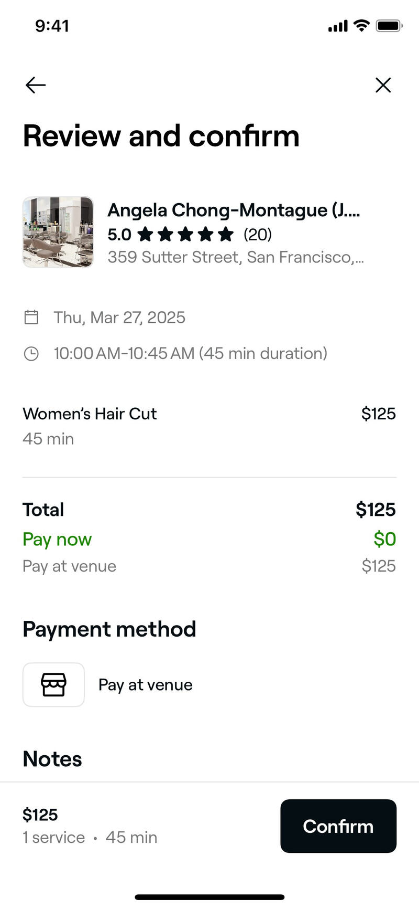
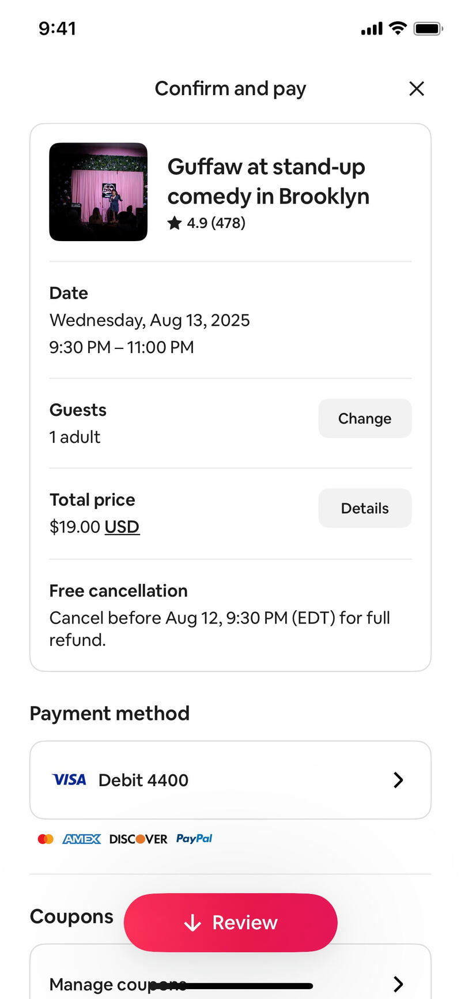
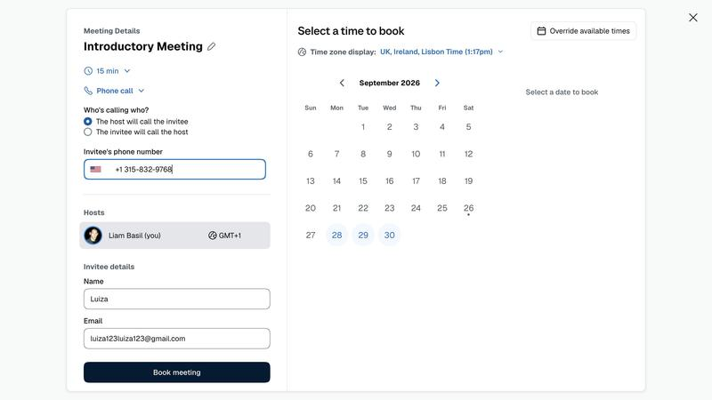
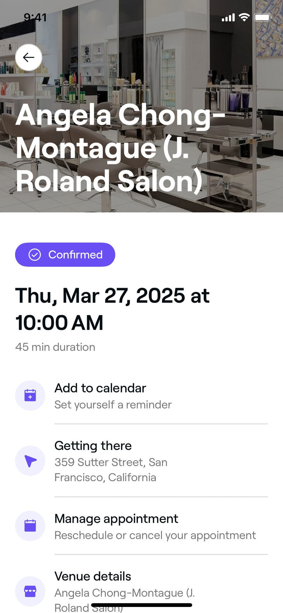

# Refero: booking a slot + confirmation (mobile)

Source: Refero MCP only, ~11 calls, page 1. Coverage gap: Refero has **no telehealth/clinician video-booking flow** on iOS
(searched; only Hims photo-upload came up). The best references are Fresha (salon booking, Health & Wellness category),
Airbnb Experiences (time slots + summary), and Calendly web (host + contact capture). The patterns carry over; the
medical framing is ours to add.

Images: `.research/img/refero-booking/`

---

## 1. Horizontal date strip + full-width slot list (Fresha)

- **What:** "Select time" screen. A scrollable row of round day chips (number + weekday) sits above big, full-width
  slot buttons (10:00, 10:15...). Days with no slots are struck through and greyed. A calendar icon opens the full month.
- **Why it converts:** one thumb, one decision per row. You can see which days have slots before you tap, so you never
  hit a dead end. Big tap targets.
- **Velora:** this should be our default picker. Show the next 7 days, strike through closed days, and open on the first
  day that has a free slot. Show times in Swedish 24h format ("09:30"), and give each slot its length
  ("09:30–09:50, 20 min").
- Refero: https://refero.design/screens/60a33848-76eb-4db1-8088-ed2f81243ecf ·
  https://refero.design/screens/c1e0e114-bcce-416c-bf5e-98a0b6710cd9

## 2. "Fully booked, go to next available date" recovery (Fresha)

- **What:** if the chosen day is full, an empty state says "Fully booked on this date · Available from Thu, Mar 27",
  with two buttons: **Go to next available date** and **Join the waitlist**.
- **Why it converts:** a full day is where people drop off, and this turns it into one tap. Saying the next free date
  up front means the user doesn't have to hunt for it.
- **Velora:** never show an empty day without a way out. Better still, put a **"Next available: tomorrow 09:30"** chip
  above the strip so the fastest path is a single tap. The waitlist becomes "Call me when a time opens up" (phone).
- Refero: https://refero.design/screens/14bc4714-0e07-47b3-b0f3-d516bac8380f

## 3. Provider picker in the time screen header (Fresha)
- **What:** an avatar pill, "Multiple professionals ▾", at the top of the time screen. You can stay on "any" or pick a
  specific person.
- **Why it converts:** "any professional" is the default, so you get the most slots, but you still have the choice.
  The faces make it feel like a real person, not a booking engine.
- **Velora:** default to "First available nurse/doctor" and show 2–3 clinician photos. Let people choose one person,
  but don't make them. Faces beat a logo for trust in medical care.
- Refero: same screen as #1

## 4. Review card: host + rating + date/time + "Pay now 0 kr" (Fresha)

- **What:** "Review and confirm" puts everything on one screen: the provider thumbnail with rating (5.0 ★, 20 reviews)
  and address, the date and time range with length, the service, then **Total / Pay now $0 (in green) / Pay at venue**.
  The Confirm button is pinned to the bottom.
- **Why it converts:** "Pay now $0" in green removes the fear of a hidden charge just before the commit. The recap
  stops people second-guessing the slot.
- **Velora:** our recap card should show the clinician photo, name and role ("legitimerad sjuksköterska"), the
  date/time with length, "Video meeting, 20 min", and **"Free — 0 kr, no commitment"** in green. Pin the CTA:
  "Book free meeting".
- Refero: https://refero.design/screens/9cfa6242-2b46-4066-a2c9-761e1acfc2fa

## 5. Free-cancellation line in the summary (Airbnb)

- **What:** the "Confirm and pay" card includes **"Free cancellation — Cancel before Aug 12, 9:30 PM for full refund"**,
  plus a "Change" button next to each editable field (guests, price details).
- **Why it builds trust:** being allowed to back out makes it easier to say yes. A "Change" button on each line keeps
  people from going back and losing their place.
- **Velora:** "You can reschedule or cancel at any time via SMS link." Add "Change" buttons next to the time and the
  phone number on the recap, so nobody has to step back through the flow.
- Refero: https://refero.design/screens/4a6e0612-c604-4771-bfba-14f4c7da0794 (flow:
  https://refero.design/flows/6417)

## 6. Host card + timezone + minimal contact fields on one panel (Calendly, web)

- **What:** the meeting details panel shows length (15 min), channel (Phone call), a **"Who's calling whom?"** radio,
  the phone number with a country flag, the host avatar with timezone, and then only **Name + Email** before
  "Book meeting".
- **Why it converts:** it asks for the minimum. It also settles who calls whom, which is a common worry before a first
  call ("will they call me?").
- **Velora:** after the slot, ask only for **first name, mobile (+46 prefilled), and email**. Everything else is already
  known from the quiz. Say plainly how the meeting happens: "You'll get a video link by SMS 15 min before. No app
  needed." The timezone is always Sweden, so skip that field.
- Refero: https://refero.design/pages/61d5d719-4b58-4c03-b6fd-280af9109c7e

## 7. Confirmation: status badge + big date + action list (Fresha)

- **What:** a full-screen "Appointment confirmed" check animation
  ([screen](https://refero.design/screens/51aa1edf-feec-4024-a72b-f671bb783800)) leads to a details page. It has a
  **Confirmed** pill, the date and time in large type with "45 min duration", then rows with icons: **Add to calendar
  (Set yourself a reminder)**, Getting there, **Manage appointment (Reschedule or cancel)**, Venue details.
- **Why it builds trust:** the confirmation can't be missed, the date is the biggest thing on the screen, and each row
  answers the question that comes next. Calling add-to-calendar a "reminder" gives people a reason to tap it.
- **Velora:** keep the Confirmed pill and the large date. Replace "Getting there" with **"What happens next"**: 3 steps
  (1. SMS confirmation now, 2. reminder + video link before the meeting, 3. a 20-min talk with a nurse about goals,
  health and whether treatment fits you). Then add "Add to calendar (.ics)" and "Reschedule/cancel".
- Refero: https://refero.design/screens/283687cc-d065-40bd-accb-f65d1c01bba0 (flow:
  https://refero.design/flows/4973)

## 8. Pre-visit question slotted between time and review (Fresha flow)
- **What:** in the Fresha flow, an optional "pre-visit question" step comes after you pick a slot and before review
  (flow 4973, steps 6→8).
- **Why:** the user has already committed to a time, so a short extra question feels like getting ready, not like a
  barrier.
- **Velora:** this is where an optional "Anything you want the nurse to know?" text field goes. Screening is already
  done in the quiz, so keep this optional and keep it to one field.
- Refero: https://refero.design/flows/4973

---

## Top 3 takeaways
1. **Never let a day be a dead end.** Offer a "Next available" shortcut and strike through closed days (Fresha). For a
   free first meeting, the fastest slot should be one tap from the result screen.
2. **Recap with a person, a price of 0 kr, and a way out.** Clinician face and role, the time with length, "Free / 0 kr"
   in green, and "Cancel or reschedule anytime" (Fresha + Airbnb). This removes the three objections people have just
   before they commit.
3. **The confirmation answers "what now?"** A large date, a Confirmed badge, a 3-step "what happens next" (SMS, video
   link, what the meeting covers), plus Add to calendar and Manage. Ask only for name, mobile and email, and say who
   contacts whom (Calendly).
