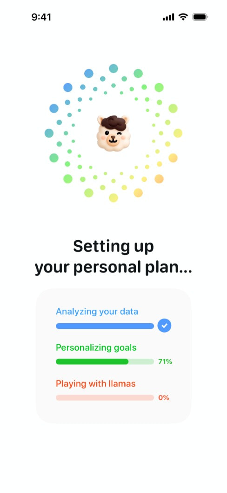
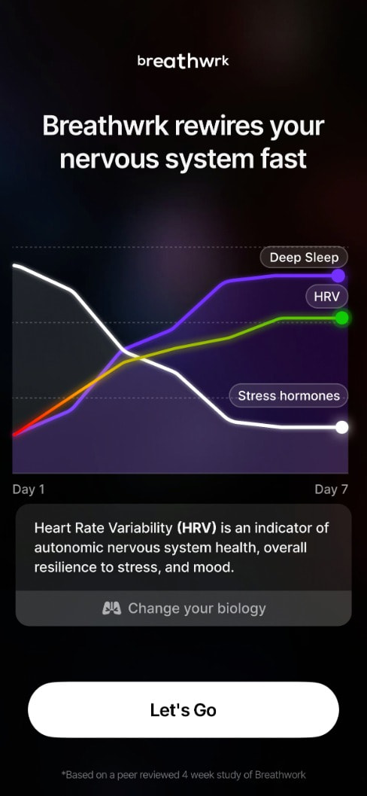
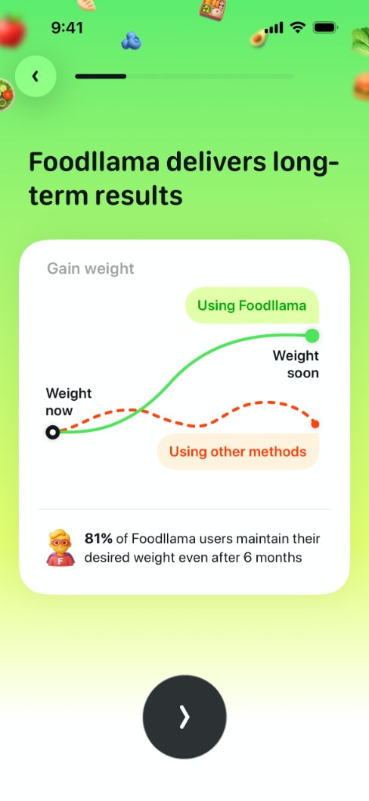
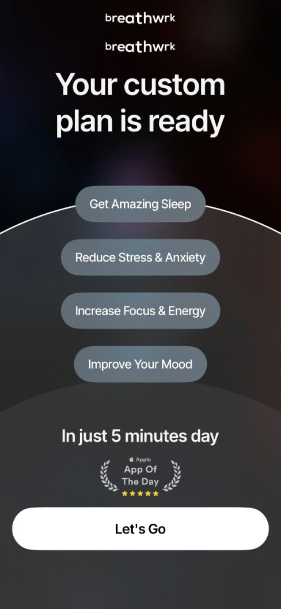
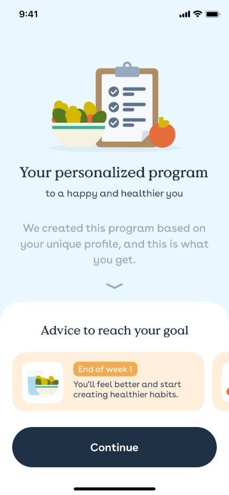
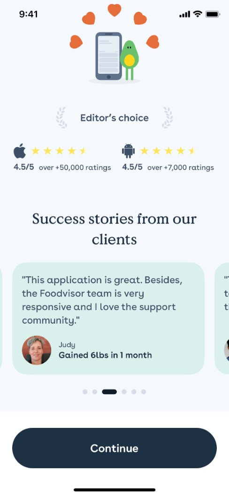

# Refero research: quiz result, plan reveal, path to booking

Slice: what happens between the last quiz answer and the "book" CTA. Source: Refero MCP (iOS), 10 calls, 2026-10-02.
All references are consumer wellness apps selling a subscription. Velora sells a free clinical meeting under Swedish
healthcare rules, so we borrow the **structure** of these screens and leave out the **hype**: no guaranteed-outcome
charts, no fake "analyzing" theatre, no "llamas".

Images: `.research/img/refero-results/`

---

## 1. "Setting up your plan" interstitial with labelled steps
**App:** Foodllama (same pattern in Mindllama, Waterllama)
**Screen:** https://refero.design/screens/97b3a5ee-e2b5-4bcb-99e0-9f7432870494

- **What:** a full-screen pause after the last question. Headline "Setting up your personal plan...", three labelled
  progress bars that fill one after another ("Analyzing your data" ✓, "Personalizing goals" 71%, a joke third bar).
- **Why it converts:** it marks the end of the questions and makes the answers feel like they were used. That raises
  the perceived value of the result (labour illusion). It also gives the next screen a small reveal.
- **Velora:** keep it to about 2 s with three *true* steps: "Checking your BMI against treatment guidelines",
  "Reviewing your health answers", "Finding available clinicians". No mascot or jokes, since this is about weight and health.
  The third step leads into booking.

## 2. Outcome graph with a credible footnote, then a single CTA
**App:** Breathwrk, "Outcome Graph + CTA" (flow 7724, step 8)
**Screen:** https://refero.design/screens/3b888731-02c8-497c-bf79-877bc7107060 · Flow: https://refero.design/flows/7724

- **What:** bold claim headline, a line chart (Day 1 to Day 7) with labelled curves, an explainer card ("HRV is an
  indicator of..."), one big "Let's Go" button, and the footnote "*Based on a peer reviewed 4 week study*".
- **Why it converts:** it shows a future the person can picture. The explainer teaches one concept, and the
  footnote supports the claim without cluttering the screen.
- **Velora:** show a typical-range band for weight over 12 months (for example, the average loss in published
  GLP-1 trials), labelled "Typical in studies, individual results vary", with a footnote citing the trial. Use one
  explainer card ("What GLP-1 does"). The CTA is "Book free meeting". **Never** show a personal prediction line. That is a
  medical/marketing compliance risk.

## 3. Personal "you now → you soon" curve with a stat
**App:** Foodllama, "Long-Term Results" (flow 11775, step 6)
**Screen:** https://refero.design/screens/e074166a-0ae9-4a2e-9868-f5184d2334f4 · Flow: https://refero.design/flows/11775

- **What:** a white card on a gradient. The chart has two endpoints, "Weight now" and "Weight soon". The solid line is
  labelled "Using Foodllama" and a dashed line "Using other methods". Below it: "81% of users maintain their weight after 6 months".
- **Why it converts:** it anchors the result in the user's *own* start point and shows a contrast with the
  alternative, plus one number for social proof.
- **Velora:** use the "now" anchor (their entered weight/BMI) and contrast "diet alone" with "medical treatment with
  support". The second curve can be a range band rather than a single line. The retention stat should be Velora's real
  number or be dropped. The card-on-soft-background layout is a good premium template for our result screen.

## 4. "Your custom plan is ready": mirror the user's goals back
**App:** Breathwrk (flow 7743, step 1)
**Screen:** https://refero.design/screens/1f769841-6ff9-48ba-bd1c-d3d387ccc6b3 · Flow: https://refero.design/flows/7743

- **What:** a large headline "Your custom plan is ready" and the goals the user chose, repeated as pills. Below them: an effort
  line ("In just 5 minutes a day"), an "App of the Day" laurel badge, and the CTA "Let's Go".
- **Why it converts:** repeating the user's own words back to them shows they were heard. The effort line answers "is
  this hard?", and the badge adds borrowed trust right above the button.
- **Velora:** the result headline is something like "Medical weight loss may suit you, {name}". Below it, 2-4 pills built
  from their answers ("BMI 32", "Tried diets before", "Wants support with appetite"). The effort line is
  "A free 20-min video call. No commitment." The trust badge sits just above the CTA (licensed clinicians, Swedish
  healthcare regulator registration, patient count).

## 5. Personalised program as a week-by-week timeline
**App:** Foodvisor
**Screen:** https://refero.design/screens/e8a40e3b-b958-47fd-b6b4-5cb765c21472

- **What:** "Your personalized program", with the subtitle "We created this program based on your unique profile". Below it, a
  horizontal carousel of milestone cards ("End of week 1: You'll feel better and start creating healthier habits")
  and a sticky "Continue" button.
- **Why it converts:** it turns an abstract result into concrete next steps. The serif heading and soft palette feel
  calm and clinical rather than salesy, which is close to the tone Velora wants.
- **Velora:** this is the best fit for "what the journey could look like" (see notes.md). Use 3-4 steps: *Free meeting
  (this week) → Prescription decision by doctor → Treatment start + check-ins → Ongoing follow-up*. Make it vertical
  instead of a carousel, since carousels hide content. Step 1 is highlighted and links to the booking CTA.

## 6. Ratings + named testimonials immediately before the CTA
**App:** Foodvisor
**Screen:** https://refero.design/screens/0358abcb-254d-4ea8-82ff-98a46477dc8e

- **What:** "Editor's choice" laurel, store ratings ("4.5/5 over 50,000 ratings"), then "Success stories from our
  clients": a quote card with a photo, first name and outcome ("Gained 6lbs in 1 month"), shown as a carousel with dots.
- **Why it converts:** proof from people like the user, placed at the moment of decision. Aggregate numbers come first,
  then a human story.
- **Velora:** use the Trustpilot score plus 1-2 quotes about the *experience* ("I felt listened to, not judged")
  rather than kilos. Kilo claims next to prescription drugs are a compliance risk and can trigger feelings of shame.
  Use a first name and age range, with no before/after photos.

## 7. Social-proof counter inside the offer (supporting pattern)
**App:** Breathwrk subscription modal (flow 7743, step 2)
**Screen:** https://refero.design/screens/23a9a497-c0b0-405f-bc4e-78ace5bd32ec

- **What:** an avatar stack in a pill, "20,128 started Premium this month!", above the benefit rows and the CTA.
- **Why it converts:** it signals momentum and that many others have done this, which lowers perceived risk.
- **Velora:** put a small pill above the booking CTA, for example "1,200+ booked a meeting this month" (only with a real figure).
  An alternative is to show availability rather than popularity, for example "Next available time: tomorrow 09:30". That works as a
  nudge and is more honest.

---

## Structural observation from the flows
In both Breathwrk (7724) and Foodllama (11775), the outcome graph comes **mid-quiz**, right after goals are chosen
and before the remaining questions. It is used as a reward to stop drop-off. The "plan ready" screen then sits
directly before the offer. For Velora this suggests one short evidence or outcome card in the middle of the quiz (after
the weight screen, where drop-off risk is high) and a result screen that leads straight into time slots.

## Top 3 takeaways
1. **Answers in, personal summary out.** The result screen should repeat the user's own answers (pills plus BMI) and
   say "may suit you" in plain words. This is what makes it feel like being understood rather than interrogated. (Patterns 4, 5)
2. **Show the journey, not a promise.** Use a vertical "what happens next" timeline (meeting → doctor decision →
   start) and, at most, a study-range band with a cited footnote. Personal kilo predictions are out. (Patterns 2, 3, 5)
3. **Trust goes right above one CTA.** Put the rating, an experience quote, clinician credentials and the "free · 20 min · no
   commitment" line right above a single "Book free meeting" button. Consider showing the first available slot on the
   result screen itself to save a step. (Patterns 4, 6, 7)
