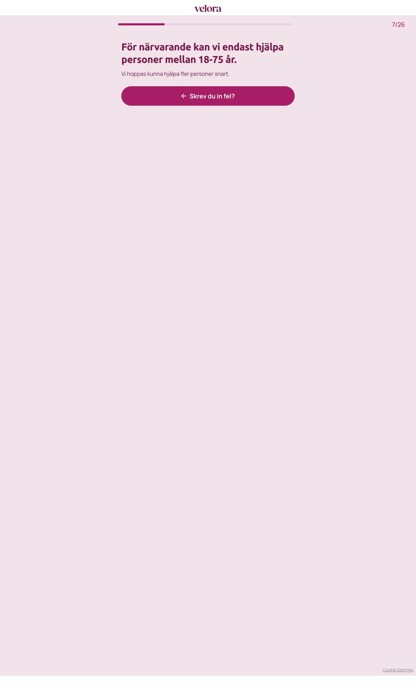

# Sidogren – Diskvalificerad (ålder)

Not part of the happy path. Reached from step 07 ("Hur gammal är du?") by picking **Under 18 år** (the first option). Documented once, then "Skrev du in fel?" was used to return.

- **URL:** https://quiz.velora.se/2-3?step=disqualified
- **Progress:** 7/26 (no back arrow shown)

## Visible text (verbatim)

```
7/26
För närvarande kan vi endast hjälpa personer mellan 18-75 år.

Vi hoppas kunna hjälpa fler personer snart.

Skrev du in fel?
```

## Buttons

- **Skrev du in fel?** – returns to the age question


