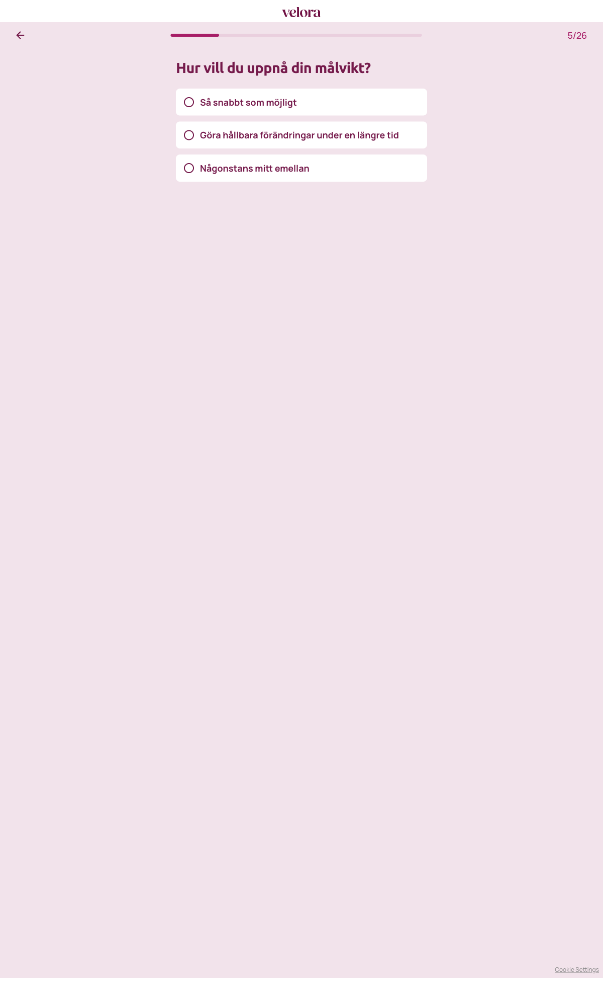

# Steg 5 – Hur vill du uppnå din målvikt?

- **URL:** https://quiz.velora.se/2-3?step=5
- **Progress:** 5/26 (progress bar at top)

## Visible text (verbatim)

```
5/26
Hur vill du uppnå din målvikt?

Så snabbt som möjligt
Göra hållbara förändringar under en längre tid
Någonstans mitt emellan
```

## Fields

| Type | Options | Required |
|---|---|---|
| Single-select (radio cards; auto-advance on click) | Så snabbt som möjligt · Göra hållbara förändringar under en längre tid · Någonstans mitt emellan | Yes (cannot advance without selecting) |

## Buttons

- **← (Go back)** – top left
- No next button; selecting an option advances automatically.

## Chosen

**Så snabbt som möjligt** (first option)


