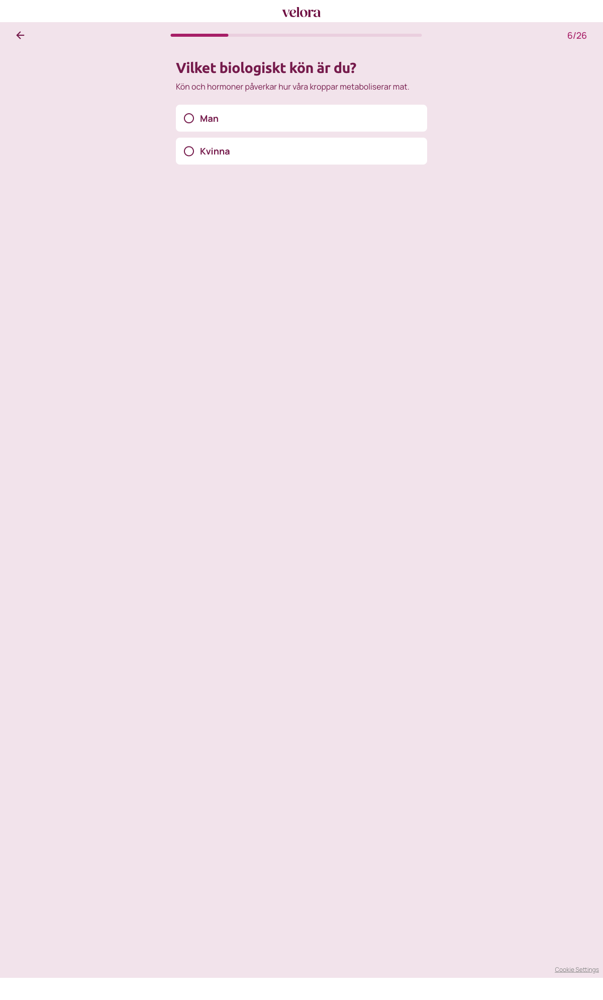

# Steg 6 – Vilket biologiskt kön är du?

- **URL:** https://quiz.velora.se/2-3?step=6
- **Progress:** 6/26 (progress bar at top)

## Visible text (verbatim)

```
6/26
Vilket biologiskt kön är du?

Kön och hormoner påverkar hur våra kroppar metaboliserar mat.

Man
Kvinna
```

## Fields

| Type | Options | Required |
|---|---|---|
| Single-select (radio cards; auto-advance on click) | Man · Kvinna | Yes (cannot advance without selecting) |

## Buttons

- **← (Go back)** – top left
- No next button; selecting an option advances automatically.

## Chosen

**Man** (first option)


