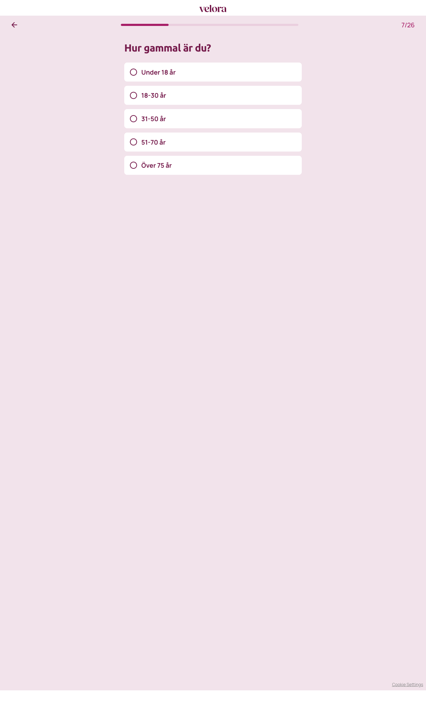

# Steg 7 – Hur gammal är du?

- **URL:** https://quiz.velora.se/2-3?step=8
- **Progress:** 7/26 (progress bar at top)

## Visible text (verbatim)

```
7/26
Hur gammal är du?

Under 18 år
18-30 år
31-50 år
51-70 år
Över 75 år
```

## Fields

| Type | Options | Required |
|---|---|---|
| Single-select (radio cards; auto-advance on click) | Under 18 år · 18-30 år · 31-50 år · 51-70 år · Över 75 år | Yes (cannot advance without selecting) |

## Buttons

- **← (Go back)** – top left
- No next button; selecting an option advances automatically.

## Chosen

**18-30 år** (second option – the first option, "Under 18 år", leads to a dead end: [side-disqualified.md](side-disqualified.md))



## Notes

- URL jumped from `step=6` to `step=8` after choosing "Man" in step 06 – `step=7` is skipped for this path (likely a female-only question). Progress counter still shows 7/26.
- Age ranges have a gap: "51-70 år" then "Över 75 år" (71–75 not covered), while the disqualification text says "18-75 år".
