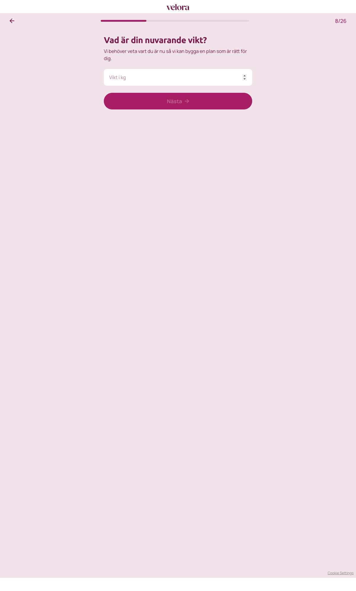

# Steg 8 – Vad är din nuvarande vikt?

- **URL:** https://quiz.companyx.example/2-3?step=9
- **Progress:** 8/26

## Visible text (verbatim)

```
8/26
Vad är din nuvarande vikt?

Vi behöver veta vart du är nu så vi kan bygga en plan som är rätt för dig.

[Vikt i kg]

Nästa
```

## Fields

| Type | Label / placeholder | Required |
|---|---|---|
| Number input (`type="number"`, no min/max attributes) | Placeholder: "Vikt i kg" | Yes in practice – "Nästa" disabled while empty (no HTML `required`) |

## Buttons

- **← (Go back)**
- **Nästa** – disabled until a value is entered

## Chosen

Entered **95**, clicked **Nästa**.


