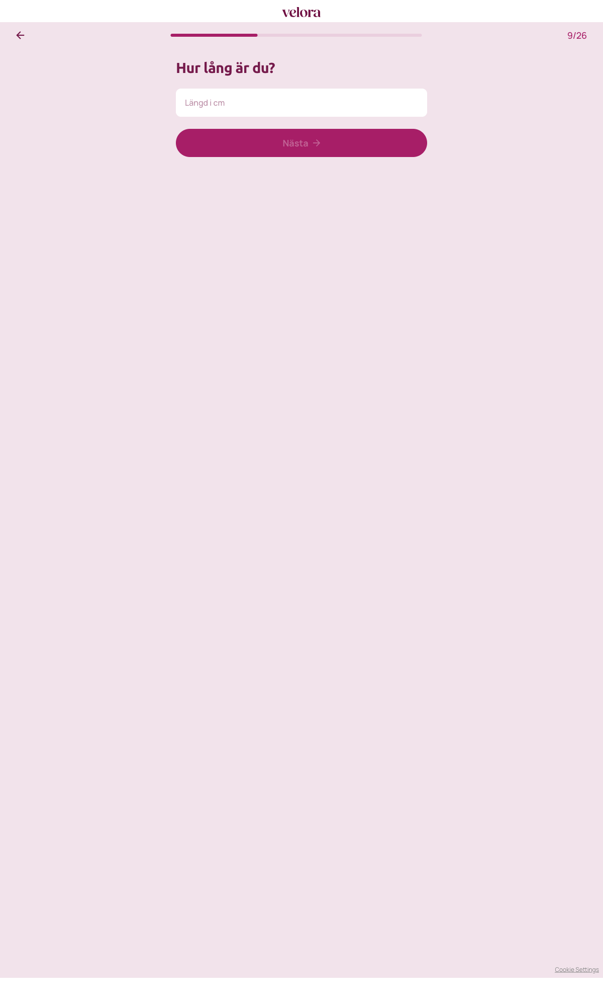

# Steg 9 – Hur lång är du?

- **URL:** https://quiz.velora.se/2-3?step=10
- **Progress:** 9/26

## Visible text (verbatim)

```
9/26
Hur lång är du?

[Längd i cm]

Nästa
```

(An empty subtitle paragraph is present in the DOM.)

## Fields

| Type | Label / placeholder | Required |
|---|---|---|
| Number input (`type="number"`) | Placeholder: "Längd i cm" | Yes in practice – "Nästa" disabled while empty |

## Buttons

- **← (Go back)**
- **Nästa** – disabled until a value is entered

## Chosen

Entered **178**, clicked **Nästa**. (95 kg / 178 cm ≈ BMI 30.)


