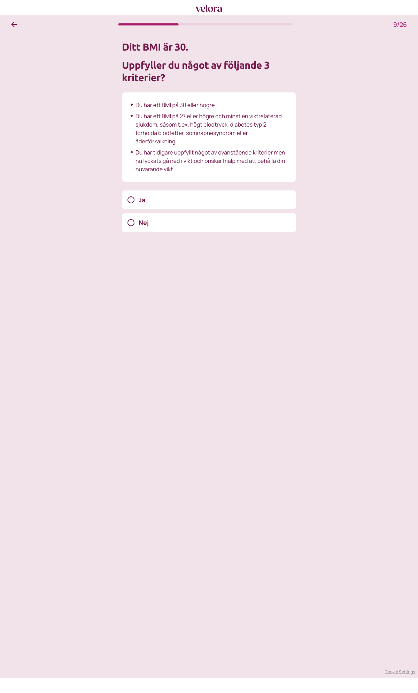

# Steg 10 – Ditt BMI är 30. Uppfyller du något av följande 3 kriterier?

- **URL:** https://quiz.companyx.example/2-3?step=bmi-criteria
- **Progress:** 9/26 (progress bar at top)

## Visible text (verbatim)

```
9/26
Ditt BMI är 30. Uppfyller du något av följande 3 kriterier?

- Du har ett BMI på 30 eller högre
- Du har ett BMI på 27 eller högre och minst en viktrelaterad sjukdom, såsom t.ex. högt blodtryck, diabetes typ 2, förhöjda blodfetter, sömnapnésyndrom eller åderförkalkning
- Du har tidigare uppfyllt något av ovanstående kriterier men nu lyckats gå ned i vikt och önskar hjälp med att behålla din nuvarande vikt

Ja
Nej
```

## Fields

| Type | Options | Required |
|---|---|---|
| Single-select (radio cards; auto-advance on click) | Ja · Nej | Yes (cannot advance without selecting) |

## Buttons

- **← (Go back)** – top left
- No next button; selecting an option advances automatically.

## Chosen

**Ja** (first option)



## Notes

- Named (non-numeric) URL step `bmi-criteria`; progress counter stays at 9/26 (same as previous step).
- Two headings: "Ditt BMI är 30." (computed from steps 08–09: 95 kg / 178 cm) and "Uppfyller du något av följande 3 kriterier?".
- The three criteria are rendered as a list above the options.
- "Nej" likely leads to a disqualification branch (not tested).
