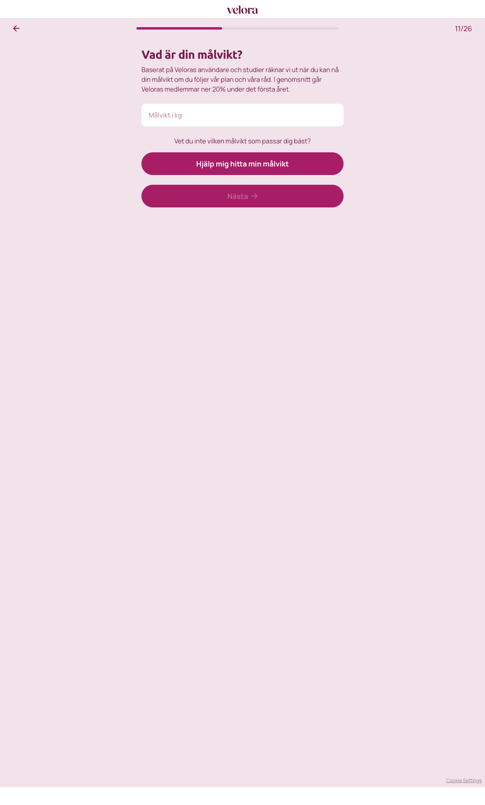

# Steg 12 – Vad är din målvikt?

- **URL:** https://quiz.velora.se/2-3?step=12
- **Progress:** 11/26

## Visible text (verbatim)

```
11/26
Vad är din målvikt?

Baserat på Veloras användare och studier räknar vi ut när du kan nå din målvikt om du följer vår plan och våra råd. I genomsnitt går Veloras medlemmar ner 20% under det första året.

[Målvikt i kg]

Vet du inte vilken målvikt som passar dig bäst?
Hjälp mig hitta min målvikt

Nästa
```

## Fields

| Type | Label / placeholder | Required |
|---|---|---|
| Text input (`type="text"`, `inputmode="numeric"`) | Placeholder: "Målvikt i kg" | Yes in practice – "Nästa" disabled while empty |

## Buttons

- **← (Go back)**
- **Hjälp mig hitta min målvikt** – secondary link-style button (not used; likely suggests a target weight)
- **Nästa** – disabled until a value is entered

## Chosen

Entered **87** (8 kg below 95, consistent with the "1-10kg" goal), clicked **Nästa**.


