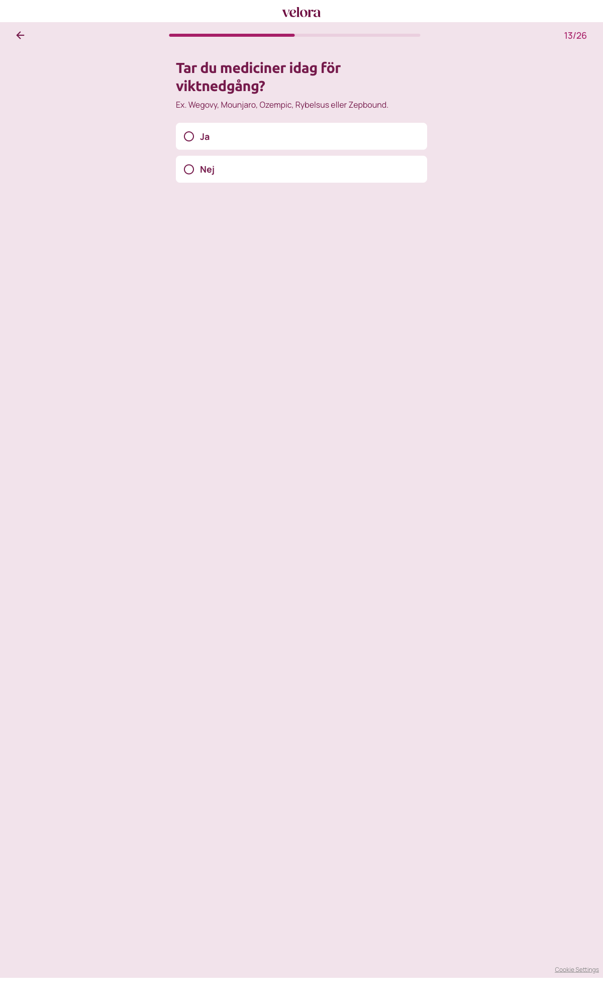

# Steg 14 – Tar du mediciner idag för viktnedgång?

- **URL:** https://quiz.companyx.example/2-3?step=14
- **Progress:** 13/26 (progress bar at top)

## Visible text (verbatim)

```
13/26
Tar du mediciner idag för viktnedgång?

Ex. Wegovy, Mounjaro, Ozempic, Rybelsus eller Zepbound.

Ja
Nej
```

## Fields

| Type | Options | Required |
|---|---|---|
| Single-select (radio cards; auto-advance on click) | Ja · Nej | Yes (cannot advance without selecting) |

## Buttons

- **← (Go back)** – top left
- No next button; selecting an option advances automatically.

## Chosen

**Ja** (first option)



## Notes

- An empty level-2 heading is present in the DOM above the options (no visible text).
