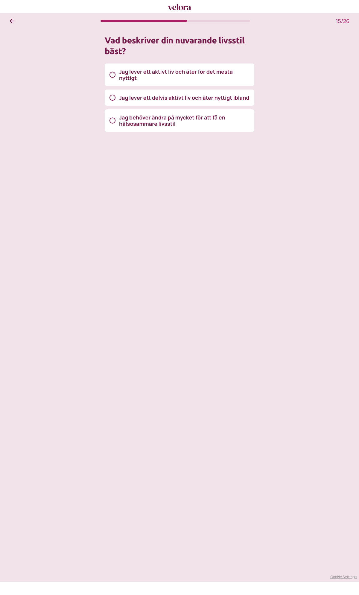

# Steg 16 – Vad beskriver din nuvarande livsstil bäst?

- **URL:** https://quiz.velora.se/2-3?step=15
- **Progress:** 15/26 (progress bar at top)

## Visible text (verbatim)

```
15/26
Vad beskriver din nuvarande livsstil bäst?

Jag lever ett aktivt liv och äter för det mesta nyttigt
Jag lever ett delvis aktivt liv och äter nyttigt ibland
Jag behöver ändra på mycket för att få en hälsosammare livsstil
```

## Fields

| Type | Options | Required |
|---|---|---|
| Single-select (radio cards; auto-advance on click) | Jag lever ett aktivt liv och äter för det mesta nyttigt · Jag lever ett delvis aktivt liv och äter nyttigt ibland · Jag behöver ändra på mycket för att få en hälsosammare livsstil | Yes (cannot advance without selecting) |

## Buttons

- **← (Go back)** – top left
- No next button; selecting an option advances automatically.

## Chosen

**Jag lever ett aktivt liv och äter för det mesta nyttigt** (first option)



## Notes

- URL stayed `step=15` after clicking "Fortsätt" on step 15 – the interstitial in step 15 and this question share the same URL param, while the progress counter advanced 14/26 → 15/26. Confirms that `step` in the URL does not map 1:1 to screens.
