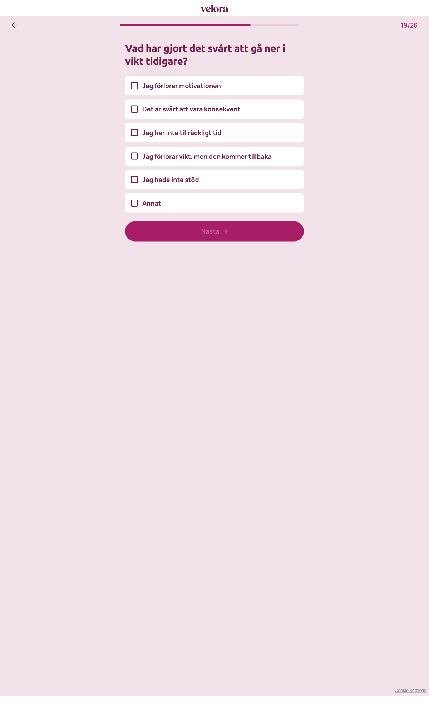

# Steg 20 – Vad har gjort det svårt att gå ner i vikt tidigare?

- **URL:** https://quiz.companyx.example/2-3?step=22
- **Progress:** 19/26 (progress bar at top)

## Visible text (verbatim)

```
19/26
Vad har gjort det svårt att gå ner i vikt tidigare?

Jag förlorar motivationen
Det är svårt att vara konsekvent
Jag har inte tillräckligt tid
Jag förlorar vikt, men den kommer tillbaka
Jag hade inte stöd
Annat

Nästa
```

## Fields

| Type | Options | Required |
|---|---|---|
| Multi-select (checkbox cards) | Jag förlorar motivationen · Det är svårt att vara konsekvent · Jag har inte tillräckligt tid · Jag förlorar vikt, men den kommer tillbaka · Jag hade inte stöd · Annat | Yes – Nästa disabled until at least one is checked |

## Buttons

- **← (Go back)** – top left
- **Nästa** – disabled until a selection is made

## Chosen

**Jag förlorar motivationen** (first option), then clicked **Nästa**


