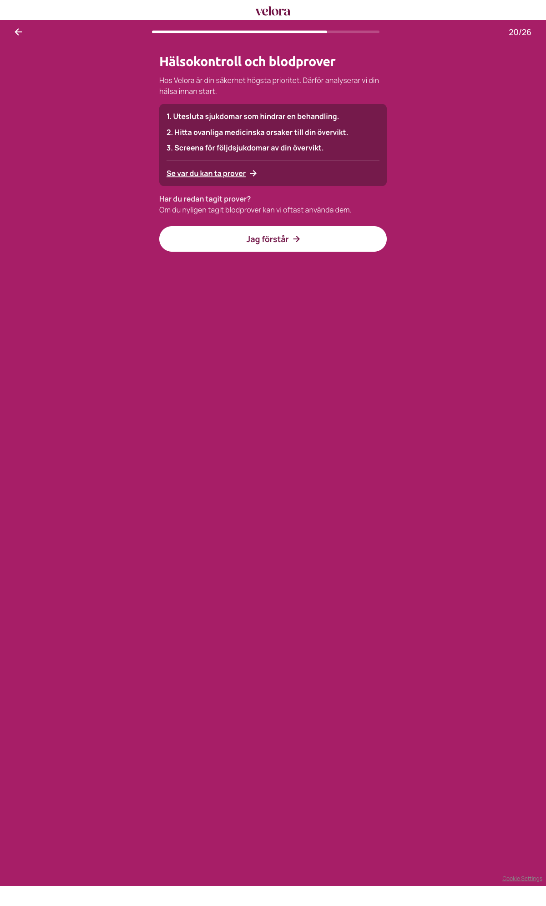

# Steg 21 – Hälsokontroll och blodprover

- **URL:** https://quiz.companyx.example/2-3?step=23
- **Progress:** 20/26
- **Kind:** Informational screen (no input)

## Visible text (verbatim)

```
20/26
Hälsokontroll och blodprover

Hos CompanyX är din säkerhet högsta prioritet. Därför analyserar vi din hälsa innan start.

1. Utesluta sjukdomar som hindrar en behandling.
2. Hitta ovanliga medicinska orsaker till din övervikt.
3. Screena för följdsjukdomar av din övervikt.

Se var du kan ta prover

Har du redan tagit prover?Om du nyligen tagit blodprover kan vi oftast använda dem.

Jag förstår
```

("Har du redan tagit prover?" is emphasized; DOM text has no space before "Om".)

## Fields

None.

## Buttons

- **← (Go back)**
- **Se var du kan ta prover** – secondary button (not clicked; likely opens a location list/modal)
- **Jag förstår** – primary, advances

## Chosen

Clicked **Jag förstår**.


