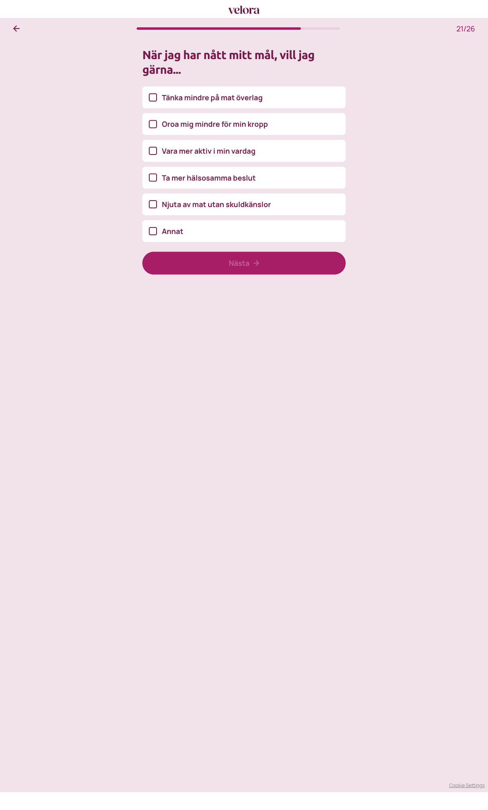

# Steg 22 – När jag har nått mitt mål, vill jag gärna...

- **URL:** https://quiz.velora.se/2-3?step=25
- **Progress:** 21/26 (progress bar at top)

## Visible text (verbatim)

```
21/26
När jag har nått mitt mål, vill jag gärna...

Tänka mindre på mat överlag
Oroa mig mindre för min kropp
Vara mer aktiv i min vardag
Ta mer hälsosamma beslut
Njuta av mat utan skuldkänslor
Annat

Nästa
```

## Fields

| Type | Options | Required |
|---|---|---|
| Multi-select (checkbox cards) | Tänka mindre på mat överlag · Oroa mig mindre för min kropp · Vara mer aktiv i min vardag · Ta mer hälsosamma beslut · Njuta av mat utan skuldkänslor · Annat | Yes – Nästa disabled until at least one is checked |

## Buttons

- **← (Go back)** – top left
- **Nästa** – disabled until a selection is made

## Chosen

**Tänka mindre på mat överlag** (first option), then clicked **Nästa**



## Notes

- URL jumped from `step=23` to `step=25` (`step=24` skipped on this path).
