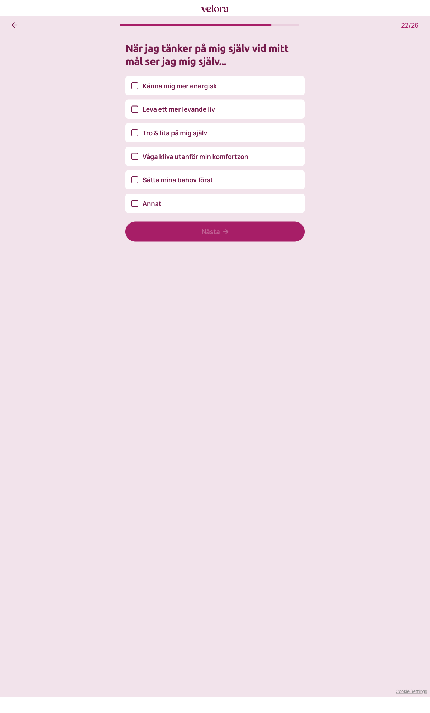

# Steg 23 – När jag tänker på mig själv vid mitt mål ser jag mig själv...

- **URL:** https://quiz.velora.se/2-3?step=26
- **Progress:** 22/26 (progress bar at top)

## Visible text (verbatim)

```
22/26
När jag tänker på mig själv vid mitt mål ser jag mig själv...

Känna mig mer energisk
Leva ett mer levande liv
Tro & lita på mig själv
Våga kliva utanför min komfortzon
Sätta mina behov först
Annat

Nästa
```

## Fields

| Type | Options | Required |
|---|---|---|
| Multi-select (checkbox cards) | Känna mig mer energisk · Leva ett mer levande liv · Tro & lita på mig själv · Våga kliva utanför min komfortzon · Sätta mina behov först · Annat | Yes – Nästa disabled until at least one is checked |

## Buttons

- **← (Go back)** – top left
- **Nästa** – disabled until a selection is made

## Chosen

**Känna mig mer energisk** (first option), then clicked **Nästa**


