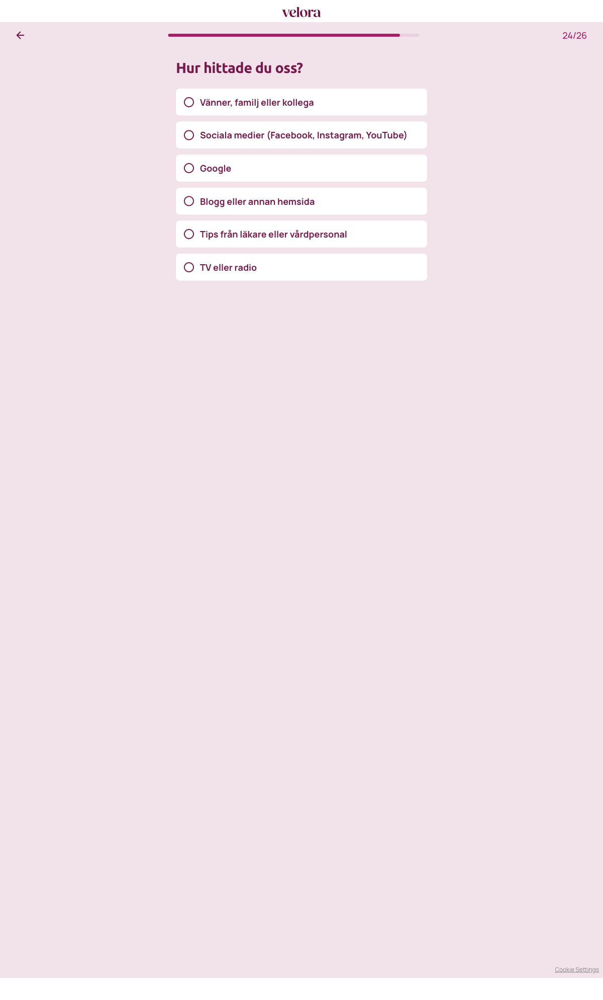

# Steg 25 – Hur hittade du oss?

- **URL:** https://quiz.companyx.example/2-3?step=28
- **Progress:** 24/26 (progress bar at top)

## Visible text (verbatim)

```
24/26
Hur hittade du oss?

Vänner, familj eller kollega
Sociala medier (Facebook, Instagram, YouTube)
Google
Blogg eller annan hemsida
Tips från läkare eller vårdpersonal
TV eller radio
```

## Fields

| Type | Options | Required |
|---|---|---|
| Single-select (radio cards; auto-advance on click) | Vänner, familj eller kollega · Sociala medier (Facebook, Instagram, YouTube) · Google · Blogg eller annan hemsida · Tips från läkare eller vårdpersonal · TV eller radio | Yes (cannot advance without selecting) |

## Buttons

- **← (Go back)** – top left
- No next button; selecting an option advances automatically.

## Chosen

**Vänner, familj eller kollega** (first option)


